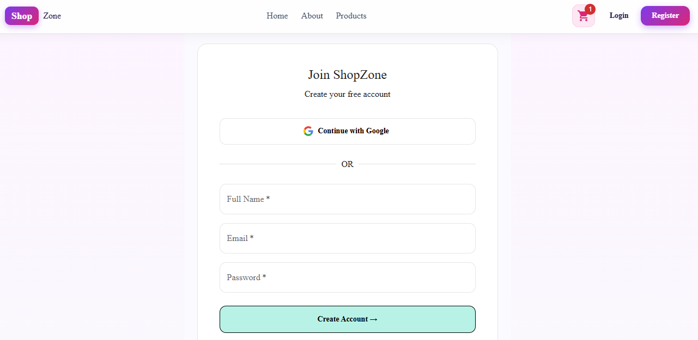
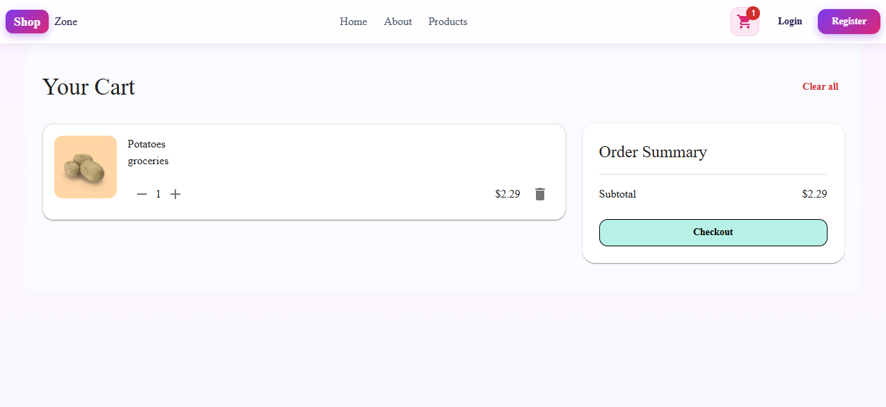

# 🛍️ ShopZone — Full-Stack E-Commerce App

A modern, full-stack e-commerce application built with **Next.js 15**, **MongoDB**, **Better Auth**, and **Material UI**.

---
## 🌐 Live Demo

[](https://ecommerce-next-task3.vercel.app)

> Deployed on **Vercel** — [https://ecommerce-next-task3.vercel.app](https://ecommerce-next-task3.vercel.app)
---
## 🚀 Tech Stack

| Technology | Purpose |
|---|---|
| **Next.js 15** (App Router) | Full-stack React framework |
| **MongoDB Atlas** | Database for products, users, orders |
| **Better Auth** | Authentication (Email + Google OAuth) |
| **Material UI (MUI v6)** | UI component library |
| **Zustand** | Client-side cart state management |
| **DummyJSON** | Seed data source for products |

---

## ✨ Features

### 🛒 Shopping
- Browse all products with **search** and **category filter**
- **Pagination** — 12 products per page
- Product detail page with image gallery, rating, stock, and brand info
- **Add to Cart** with quantity management
- **Persistent cart** — survives page refresh (Zustand + localStorage)
- Cart page with item quantity controls, remove, and clear all
- Order summary with subtotal and free shipping

### 🔐 Authentication
- **Email & Password** sign up / sign in
- **Google OAuth** sign up / sign in
- Session management via Better Auth
- User avatar + name shown in Navbar when logged in
- Sign out button

### 🗄️ Database (MongoDB)
- Products stored in MongoDB Atlas (`shopzone` database)
- Full **CRUD** operations on products
- Search by title/description using MongoDB `$regex`
- Filter by category using `distinct`
- Pagination with `skip` and `limit`

### 🛠️ Admin Panel (`/admin`)
- View all products in a data table with search
- **Add** new product with form validation and image preview
- **Edit** existing product — pre-filled form
- **Delete** product with confirmation dialog
- Live stock status indicator (green/red)

### ⚡ Performance
- **ISR (Incremental Static Regeneration)** on product pages — revalidates every 60 seconds
- `generateStaticParams` pre-renders top 50 product pages at build time
- Next.js Image optimization with `sizes` prop
- MongoDB connection pooling via global client promise

---

## 📁 Project Structure

```
ecommerce/
├── app/
│   ├── page.js                     # Home — Featured products + categories
│   ├── layout.js                   # Root layout with Navbar + Providers
│   ├── globals.css
│   ├── products/
│   │   ├── page.jsx                # Products listing with search/filter (ISR)
│   │   └── [id]/page.jsx           # Product detail (ISR)
│   ├── cart/page.jsx               # Cart page
│   ├── login/page.jsx              # Login (Email + Google)
│   ├── register/page.jsx           # Register
│   ├── admin/
│   │   ├── page.jsx                # Admin — product table
│   │   ├── add/page.jsx            # Add product form
│   │   └── edit/[id]/page.jsx      # Edit product form
│   └── api/
│       ├── auth/[...all]/route.js  # Better Auth handler
│       ├── products/
│       │   ├── route.js            # GET all (search/filter/paginate) + POST
│       │   └── [id]/route.js       # GET one + PUT + DELETE
│       └── categories/route.js     # GET distinct categories
├── components/
│   ├── Navbar.jsx                  # Sticky navbar with cart badge + auth
│   ├── ProductCard.jsx             # Product card with Add to Cart
│   ├── ProductsClient.jsx          # Client-side products list
│   ├── AddToCartButton.jsx         # Add to cart with feedback
│   ├── Providers.jsx               # MUI ThemeProvider + AppRouterCacheProvider
    ├── ProductImageViewer.jsx  
    └── Footer.jsx  

├── lib/
    ├── auth.js                     # Better Auth config
    ├── auth-client.js              # Better Auth client
    ├── mongodb.js                  # MongoDB connection (singleton)
    └── store.js                    # Zustand cart store

```

---

## 🔧 Environment Variables

Create a `.env.local` file in the root:

```env
NEXT_PUBLIC_BASE_URL=http://localhost:3000
NEXT_PUBLIC_APIURL=https://dummyjson.com/products

MONGODB_URI=your_mongodb_connection_string

BETTER_AUTH_SECRET=your_secret_key
BETTER_AUTH_URL=http://localhost:3000
NEXT_PUBLIC_BETTER_AUTH_URL=http://localhost:3000

GOOGLE_CLIENT_ID=your_google_client_id
GOOGLE_CLIENT_SECRET=your_google_client_secret
```

---

## 📦 Installation

```bash
# 1. Install dependencies
npm install

# 2. Install MUI + Auth + DB packages
npm install @mui/material @mui/icons-material @mui/material-nextjs
npm install @emotion/react @emotion/styled @emotion/cache
npm install better-auth mongodb zustand lucide-react


# 3. Run the development server
npm run dev
```

---

## 🌐 Pages & Routes

| Route | Description |
|---|---|
| `/` | Home — hero, categories, featured products |
| `/products` | All products with search, filter, pagination |
| `/products/[id]` | Product detail with image gallery |
| `/cart` | Shopping cart |
| `/login` | Sign in (Email + Google) |
| `/register` | Create account |
| `/admin` | Admin product table |
| `/admin/add` | Add new product |
| `/admin/edit/[id]` | Edit existing product |

---

## 🔌 API Endpoints

| Method | Endpoint | Description |
|---|---|---|
| `GET` | `/api/products` | Get products (supports `search`, `category`, `limit`, `skip`) |
| `POST` | `/api/products` | Create new product |
| `GET` | `/api/products/[id]` | Get single product by MongoDB `_id` |
| `PUT` | `/api/products/[id]` | Update product |
| `DELETE` | `/api/products/[id]` | Delete product |
| `GET` | `/api/categories` | Get all distinct categories |
| `GET/POST` | `/api/auth/[...all]` | Better Auth handler |

---

## 🎨 Design System

- **Theme**: Soft pastel color palette
- **Primary gradient**: `#7c3aed → #db2777` (purple to pink)
- **Background**: `#fdf4ff` soft lavender
- **Card colors**: Pastel pink, blue, yellow, purple, green, orange
- **Font weight**: 700–900 for headings
- **Border radius**: 12–24px rounded corners
- **Shadows**: Soft diffused shadows (`rgba(0,0,0,0.06)`)

---

## 🔒 Google OAuth Setup

1. Go to [Google Cloud Console](https://console.cloud.google.com)
2. Create a new project or select existing
3. Enable **Google+ API**
4. Go to **Credentials** → **Create OAuth Client ID**
5. Add Authorized redirect URI:
   ```
   http://localhost:3000/api/auth/callback/google
   ```
6. Copy `Client ID` and `Client Secret` to `.env.local`

---

## 📋 Dependencies

```json
{
  "dependencies": {
    "next": "^15.0.0",
    "react": "^19.0.0",
    "@mui/material": "^6.0.0",
    "@mui/icons-material": "^6.0.0",
    "@mui/material-nextjs": "^6.0.0",
    "@emotion/react": "^11.0.0",
    "@emotion/styled": "^11.0.0",
    "@emotion/cache": "^11.0.0",
    "better-auth": "^1.0.0",
    "mongodb": "^6.0.0",
    "zustand": "^5.0.0"
  }
}
```

---

## 🌱 Seed Script

The seed script fetches ~200 products from [DummyJSON](https://dummyjson.com) and inserts them into MongoDB:

```bash
node scripts/seed.js
```

This will:
- Connect to your MongoDB Atlas cluster
- Clear existing products
- Insert 200 products with images, ratings, stock, categories, and pricing

---

## 📝 Notes

- **Auth-protected Admin** — admin panel is only visible in the Navbar when the user is logged in
- **Cart is client-side only** — not saved to database
- **ISR revalidates every 60 seconds** — product pages stay fresh without full rebuilds
- MongoDB `_id` is always serialized to string before passing to client components



